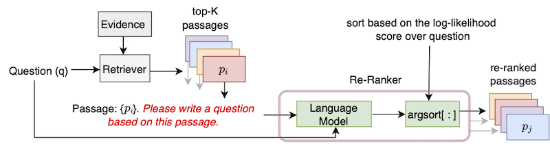
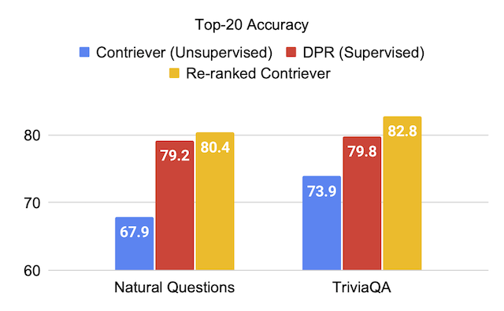

<a id="contents"></a>
# Contents
<!-- MarkdownTOC -->

- [Setup](#setup)
- [Input Data Format](#input-data-format)
- [Downloading Data](#downloading-data)
- [Usage](#usage)
- [Results](#results)
- [Issues](#issues)
- [Citation](#citation)

<!-- /MarkdownTOC -->

This repository contains the official implementation of the UPR (Unsupervised Passage Re-ranking) algorithm introduced in the paper "[Improving Passage Retrieval with Zero-Shot Question Generation](https://arxiv.org/abs/2204.07496)".

## UPR Algorithm
<p align="center">
  
</p>


#### Results after re-ranking Contriever's top-1000 wikipedia passages
<p align="center">
  
</p>


<a id="setup"></a>
# Setup

To use this repo, a standard installation of [PyTorch](https://pytorch.org/) is needed.
We provide dependencies in the requirements.txt file.

We recommend using one of [NGC's more recent PyTorch containers](https://catalog.ngc.nvidia.com/orgs/nvidia/containers/pytorch/tags). 
A docker image can be pulled with the command `docker pull nvcr.io/nvidia/pytorch:22.01-py3`.
To use this docker image, an installation of the [Nvidia container toolkit](https://docs.nvidia.com/datacenter/cloud-native/container-toolkit/install-guide.html#install-guide) is also required.

Over the docker container, please install the libraries `transformers` and `sentencepiece` using pip install.


<a id="input-data-format"></a>
# Input Data Format

#### Wikipedia Evidence Passages
We follow the [DPR convention](https://arxiv.org/abs/2004.04906) and segment the Wikipedia articles into 100-word long passages.
DPR's provided evidence file can be downloaded with the command
```python
python utils/download_data.py --resource data.wikipedia-split.psgs_w100
```
This evidence file contains tab-separated fields for passage id, passage text, and passage title. 

```bash
id  text    title
1   "Aaron Aaron ( or ; ""Ahärôn"") is a prophet, high priest, and the brother of Moses in the Abrahamic religions. Knowledge of Aaron, along with his brother Moses, comes exclusiv
ely from religious texts, such as the Bible and Quran. The Hebrew Bible relates that, unlike Moses, who grew up in the Egyptian royal court, Aaron and his elder sister Miriam remained 
with their kinsmen in the eastern border-land of Egypt (Goshen). When Moses first confronted the Egyptian king about the Israelites, Aaron served as his brother's spokesman (""prophet"
") to the Pharaoh. Part of the Law (Torah) that Moses received from"    Aaron
2   "God at Sinai granted Aaron the priesthood for himself and his male descendants, and he became the first High Priest of the Israelites. Aaron died before the Israelites crossed
 the North Jordan river and he was buried on Mount Hor (Numbers 33:39; Deuteronomy 10:6 says he died and was buried at Moserah). Aaron is also mentioned in the New Testament of the Bib
le. According to the Book of Exodus, Aaron first functioned as Moses' assistant. Because Moses complained that he could not speak well, God appointed Aaron as Moses' ""prophet"" (Exodu
s 4:10-17; 7:1). At the command of Moses, he let"   Aaron
... ... ...
``` 

#### Top-K Retrieved Data
The input data format is JSON. Each dictionary in the json file contains one question, a list containing data of the top-K retrieved passages, and an (optional) list of possible answers.
For each top-K passage, we include the (evidence) id, has_answer , and (optional) retriever score attributes.
The `id` attribute is passage id from the Wikipedia evidence file, `has_answer` denotes if the passage text contains the answer span or not.
Following is the template of the .json file

```json
[
  {
    "question": "....",
    "answers": ["...", "...", "..."],
    "ctxs": [
              {
                "id": "....",
                "score": "...",
                "has_answer": "....",
              },
              ...
            ]
  },
  ...
]
```

An example when passages are retrieved using BM25 when queries using Natural Questions dev set.
```json
[
  {
    "question": "who sings does he love me with reba",
    "answers": ["Linda Davis"],
    "ctxs": [     
              {
               "id": 11828871,
               "score": 18.3,
               "has_answer": false
              },
              {
                "id": 11828872,
                "score": 14.7,
                "has_answer": false,
              },
              {
                "id": 11828866,
                "score": 14.4,
                "has_answer": true,
              },
           ...
            ]
  },
  ...
]
```

<a id="downloading-data"></a>
# Downloading Data

We provide the top-1000 retrieved passages for the dev/test splits of NaturalQuestions-Open (NQ), TriviaQA, SQuAD-Open, WebQuestions (WebQ), and EntityQuestions (EQ) datasets covering 5 retrievers: 
[BM25](https://github.com/castorini/pyserini/blob/master/docs/experiments-dpr.md), [MSS](https://arxiv.org/abs/2101.00408), [Contriever](https://arxiv.org/abs/2112.09118), [DPR](https://arxiv.org/abs/2004.04906), and [MSS-DPR](https://arxiv.org/abs/2101.00408).
Please use the following command to download these datasets

```python
python utils/download_data.py \
	--resource {key from download_data.py's RESOURCES_MAP}  \
	[optional --output_dir {your location}]
```

For example, to download all the top-K data, use `--resource data`.
To download a specific retriever's top-K data, for example BM25, use `--resource data.retriever-outputs.bm25`.


<a id="usage"></a>
# Usage

To re-rank the retrieved passages with UPR, please use the following command where the paths of the evidence file and top-K retrieved passage file needs to be indicated.   

```bash

DISTRIBUTED_ARGS="-m torch.distributed.launch --nproc_per_node 8 --nnodes 1 --node_rank 0 --master_addr localhost --master_port 6000"

python ${DISTRIBUTED_ARGS} upr.py \ 
  --num-workers 2 \
  --log-interval 1 \
  --topk-passages 1000 \
  --hf-model-name "bigscience/T0_3B" \
  --use-gpu \
  --use-bf16 \
  --report-topk-accuracies 1 5 20 100 \
  --evidence-data-path "wikipedia-split/psgs_w100.tsv" \
  --retriever-topk-passages-path "bm25/nq-dev.json"
```

`--use-bf16` option provides speed ups and memory savings on Ampere GPUs such as A100 or A6000. However, when working with V100 GPUs, this argument should be removed.


We have provided an example script "[upr-demo.sh](examples/upr-demo.sh)" under the directory "[examples](examples)".
To use this script, please modify the data and input / output file paths accordingly.

<a id="results"></a>
# Results

 We provide the evaluation scores on the test sets of datasets when using T0-3B language model in UPR.

### Passage Retrieval
* Top-20 retrieval accuracy for unsupervised retrievers

Retriever (+Re-ranker)  | SQuAD-Open | TriviaQA | Natural Questions-Open | Web Questions | Entity Questions
 ------------      |:-----------:|:-----------:|:-------:|:------:|:------:|
MSS                | 51.3 | 67.2 | 60.0 | 49.2 | 51.2 |
MSS + *UPR*        | 75.7 | 81.3 | 77.3 | 71.8 | 71.3 | 
BM25               | 71.1 | 76.4 | 62.9 | 62.4 | 71.2 |
BM25 + *UPR*       | **83.6** | **83.0** | 78.6 | 72.9 | **79.3** |  
Contriever         | 63.4 |  73.9 | 67.9 | 65.7 | 63.0 |
Contriever + *UPR* | 81.3 | 82.8 | **80.4** | **75.7** | 76.0

* Top-20 retrieval accuracy for supervised retrievers

Retriever (+Re-ranker)  | SQuAD-Open | TriviaQA | Natural Questions-Open | Web Questions | Entity Questions
 ------------      |:-----------:| :-----------: |:-----:|:----:|:---:|
DPR                | 59.4 | 79.8 | 79.2 | 74.6 | 51.1 |
DPR + *UPR*        | 80.7 | 84.3 | 83.4 | 76.5 | 65.4 |
MSS-DPR            | 73.1 | 81.9 | 81.4 | 76.9 | 60.6 |
MSS-DPR + *UPR*    | **85.2** | **84.8** | **83.9** | **77.2** | 73.9 |


### Ablation Study: Impact of Pre-trained Language Models

We re-rank the union of top-1000 passages retrieved from each of BM25 and MSS retrievers Natural Questions-Open development set.
This data file can be downloaded as:

```bash
python utils/download_data.py --resource data.retriever-outputs.mss-bm25-union.nq-dev
``` 

For these ablation experiments, we pass the argument `--topk-passages 2000` as this file contains the union of two sets of top-1000 passages.

Language Model | Retriever | Top-1 | Top-5 | Top-20 | Top-100
|--------------|:-----:|:-----:|:------:|:------:|:------:|
| -            | BM25 | 22.3  | 43.8 | 62.3 | 76.0 |  
| -            | MSS  | 17.7  | 38.6 | 57.4 | 72.4 |
|[T5 (3B)](https://huggingface.co/google/t5-v1_1-xl)   | BM25 + MSS | 22.0 | 50.5 | 71.4 | 84.0 |
|[GPT-neo (2.7B)](https://huggingface.co/EleutherAI/gpt-neo-2.7B)| BM25 + MSS | 27.2 | 55.0 | 73.9 | 84.2 |
|[GPT-j (6B)](https://huggingface.co/EleutherAI/gpt-j-6B) | BM25 + MSS | 29.8 | 59.5 | 76.8 | 85.6 |
|[T5-lm-adapt (250M)](https://huggingface.co/google/t5-base-lm-adapt) | BM25 + MSS | 23.9 | 51.4 | 70.7 | 83.1 |
|[T5-lm-adapt (800M)](https://huggingface.co/google/t5-large-lm-adapt) | BM25 + MSS | 29.1 | 57.5 | 75.1 | 84.8 |
|[T5-lm-adapt (3B)](https://huggingface.co/google/t5-xl-lm-adapt) | BM25 + MSS | 29.7 | 59.9 | 76.9 | 85.6 |
|[T5-lm-adapt (11B)](https://huggingface.co/google/t5-xxl-lm-adapt) | BM25 + MSS | 32.1 | 62.3 | 78.5 | 85.8 |
|[T0-3B](https://huggingface.co/bigscience/T0_3B) | BM25 + MSS | 36.7 | **64.9** | **79.1** | **86.1** |
|[T0-11B](https://huggingface.co/bigscience/T0) | BM25 + MSS | **37.4** | **64.9** | **79.1** | 86.0 |

The GPT models can be run in UPR by using the script `gpt/upr_gpt.py`. This script has similar options to that of `upr.py` script, but we need to pass `--use-fp16` as the argument instead of `--use-bf16`.
The argument of `--hf-model-name` can be either `EleutherAI/gpt-neo-2.7B` or `EleutherAI/gpt-j-6B`.

### Open-Domain QA Experiments
Please see the directory [open-domain-qa](open-domain-qa/README.md) for details to do training and inference with the pre-trained checkpoints.

<a id="issues"></a>
# Issues
For any errors or bugs in the codebase, please either open a new issue or send an email to Devendra Singh Sachan (sachan.devendra@gmail.com) .

<a id="citation"></a>
# Citation

If you find this code or data useful, please consider citing our paper as:

```bash
@article{sachan2022improving,
  title = "Improving Passage Retrieval with Zero-Shot Question Generation",
  author = "Sachan, Devendra Singh and Lewis, Mike and Joshi, Mandar and Aghajanyan, Armen and Yih, Wen-tau and Pineau, Joelle and Zettlemoyer, Luke",
  booktitle = "Proceedings of the 2022 Conference on Empirical Methods in Natural Language Processing",
  publisher = "Association for Computational Linguistics",
  url = "https://arxiv.org/abs/2204.07496",
  year = "2022"
}
```
