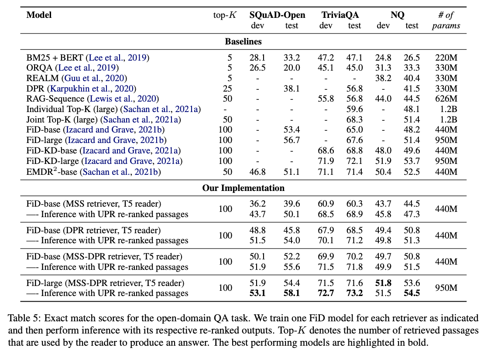

<a id="contents"></a>
# Contents
<!-- MarkdownTOC -->

- [Setup](#setup)
- [Downloading Data and Checkpoints](#downloading-data-and-checkpoints)
- [Usage](#usage)
- [Pre-trained Checkpoints](#pre-trained-checkpoints)

<!-- /MarkdownTOC -->


Fusion-in-Decoder is a training algorithm for the task of open-domain question answering. 


**Results**
<p align="center">
  
</p>


<a id="setup"></a>
# Setup

To use this repo, we recommend using one of [NGC's more recent PyTorch containers](https://catalog.ngc.nvidia.com/orgs/nvidia/containers/pytorch/tags). 
The image version used in this paper can be pulled with the command `docker pull nvcr.io/nvidia/pytorch:20.10-py3`. 

An installation of the [Nvidia container toolkit](https://docs.nvidia.com/datacenter/cloud-native/container-toolkit/install-guide.html#install-guide) may also be required.


To run the above image in an interactive mode, please use this command
<pre>
sudo docker run --ipc=host --gpus all -it --rm -v /mnt/disks:/mnt/disks nvcr.io/nvidia/pytorch:20.10-py3 bash
</pre>
, where `/mnt/disks` is the directory to be mounted.

<a id="downloading-data-and-checkpoints"></a>
## Downloading Data and Checkpoints
We've provided pretrained checkpoints and datasets on Dropbox for use to train models for dense retrieval and open-domain QA tasks. 
This data can be downloaded here:

Required training files
- [Wikipedia Evidence Documents from DPR paper](https://www.dropbox.com/s/bezryc9win2bha1/psgs_w100.tar.gz)
- [Indexed evidence documents and titles](https://www.dropbox.com/s/nc49dkno8o3pgb3/evidence-wikipedia-indexed-mmap.tar.gz)
- [Dataset-specific question-answer pairs](https://www.dropbox.com/s/gm0y3lx1wv0uxx2/qas.tar.gz)
- [BERT-large vocabulary file](https://www.dropbox.com/s/ttblv1uggd4cijt/bert-large-uncased-vocab.txt)

Required checkpoints
- [T5 or Masked Salient Span (MSS) pre-trained reader](https://www.dropbox.com/s/33lm2685ifpei4l/mss-emdr2-reader-base-steps82k.tar.gz)


<a id="usage"></a>
# Usage

We've provided a demo scripts for training an FiD model for open-domain QA tasks in [`examples`](./examples) directory.

Please ensure to change the data and checkpoint paths in these scripts.

To train or do inference using a pre-trained model, please see the options and run the script as
```
bash examples/fid_common.sh
```

<a id="pre-trained-checkpoints"></a>
# Pre-trained Checkpoints

Dataset | Retriever | Reader Config | Dev EM | Test EM | Checkpoint 
--------|-----------|---------------|--------|---------|:-----------:
Natural Questions | MSS + UPR | base | 45.8 | 47.3 | [link](https://www.dropbox.com/s/2lbphzcac4w2tfp/fid-mss-nq-base-topk100-bsize64.tar.gz)
Natural Questions | DPR + UPR | base | 49.8 | 51.3 | [link](https://www.dropbox.com/s/sno9ms6zphtajxq/fid-dpr-nq-base-topk100-bsize64.tar.gz)
Natural Questions | MSS-DPR + UPR | base | 49.9 | 51.5 | [link](https://www.dropbox.com/s/fo9vgophu81yjm3/fid-mss-dpr-nq-base-topk100-bsize64.tar.gz)
Natural Questions | MSS-DPR + UPR | large | 51.5 | 54.5 | [link](https://www.dropbox.com/s/wqbyq7b96hlaahr/fid-mss-dpr-nq-large-topk100-bsize64.tar.gz) 
TriviaQA | MSS + UPR | base | 68.5 | 68.9 | [link](https://www.dropbox.com/s/s92am9wcwunv1q5/fid-mss-trivia-base-topk100-bsize64.tar.gz)
TriviaQA | DPR + UPR | base | 70.1 | 71.2 | [link](https://www.dropbox.com/s/dl0tb4at6090h00/fid-dpr-trivia-base-topk100-bsize64.tar.gz)
TriviaQA | MSS-DPR + UPR | base | 71.5 | 71.8 | [link](https://www.dropbox.com/s/7qpnndn3cf0rwkp/fid-mss-dpr-trivia-base-topk100-bsize64.tar.gz)
TriviaQA | MSS-DPR + UPR | large | 72.7 | 73.2 | [link](https://www.dropbox.com/s/2xlemikbnq86yf9/fid-mss-dpr-trivia-large-topk100-bsize64.tar.gz)
SQuAD-Open | MSS + UPR | base | 43.7 | 50.1 | [link](https://www.dropbox.com/s/36zhaxim0lax9uv/fid-mss-squad1-base-topk100-bsize64.tar.gz)
SQuAD-Open | DPR + UPR | base | 51.5 | 54.0 | [link](https://www.dropbox.com/s/sb10urzlzs0jcmb/fid-dpr-squad1-base-topk100-bsize64.tar.gz)
SQuAD-Open | MSS-DPR + UPR | base | 51.9 | 55.6  | [link](https://www.dropbox.com/s/7a61gt3zuivxto8/fid-mss-dpr-squad1-base-topk100-bsize64.tar.gz)
SQuAD-Open | MSS-DPR + UPR | large | 53.1 | 58.1 | [link](https://www.dropbox.com/s/nx4ahlhuywdvjg8/fid-mss-dpr-squad1-large-topk100-bsize64.tar.gz)
